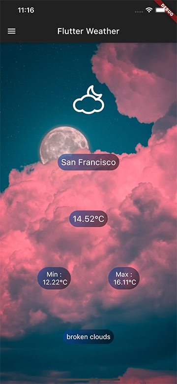

# Flutter Weather  

A Flutter Weather app to learn more about Flutter

## Description

A simple Flutter App that gives the weather forecast for a selected locality.

Training to use :

    - SharedPreferences
    - Json
    - Geocoding & Location
    - Http request & Dio
    - Custom Icons
    - BoxDecoration
    - Drawer

## Run on :

    - Android
    - IOS

## How to use

When you download or clone the project, before running a build for Android or IOS you have to add an API KEY for OpenWeatherMap in the const String named KEY:

    - lib/widget/home.dart
      - const String KEY = "xxxxxxxxxxxxxxxxxxxxxxxxxx"
  
Log in or create an account on [OpenWeatherMap.com](https://openweathermap.org/api) and generate an APIKEY  

## Screenshots

Request permission to locate the user

Home Page after geolocation of the user Android

Home Page after geolocation of the user IOS

Drawer allows you to add cities

Selection of cities added by the user

Home Page for the user's selected city

